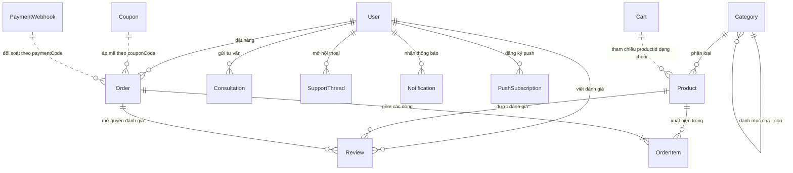

# Cấu trúc Database — CareWise (Tóc Tai)

Tài liệu tổng hợp toàn bộ database của hệ thống. Nguồn sự thật là các file trong
`src/models/*.ts`; các ràng buộc bổ sung ở tầng API nằm trong `src/lib/server/validators.ts`
và từng route `src/app/api/**`. Khi sửa model, cập nhật lại file này.

---

## 1. Tổng quan

| Hạng mục | Giá trị |
|---|---|
| Hệ quản trị | MongoDB (Mongoose 9) |
| File kết nối | `src/lib/server/db.ts` |
| Biến môi trường | `MONGODB_URI` (bắt buộc), `MONGODB_DB` (mặc định `toc_tai`) |
| Số collection | 16 |
| Timeout chọn server | 5000ms |

### Quy ước chung

- Mỗi document có `_id` kiểu `ObjectId` do MongoDB tự sinh (trừ các sub-document khai báo `{ _id: false }`).
- Tất cả 16 schema đều bật `timestamps` → mỗi document có `createdAt` và `updatedAt` kiểu `Date`.
- `Product`, `CatalogProduct`, `PaymentWebhook` bật `minimize: false` → object rỗng `{}` vẫn được lưu, không bị Mongoose xoá.
- Tên collection do Mongoose tự số nhiều hoá từ tên model.

| Model | Collection | Model | Collection |
|---|---|---|---|
| `User` | `users` | `Order` | `orders` |
| `Category` | `categories` | `Coupon` | `coupons` |
| `Product` | `products` | `Cart` | `carts` |
| `CatalogProduct` | `catalogproducts` | `PaymentWebhook` | `paymentwebhooks` |
| `Media` | `media` | `Review` | `reviews` |
| `Banner` | `banners` | `Consultation` | `consultations` |
| `Settings` | `settings` | `SupportThread` | `supportthreads` |
| `Notification` | `notifications` | `PushSubscription` | `pushsubscriptions` |

---

## 2. Sơ đồ quan hệ



Quan hệ nét liền là tham chiếu `ObjectId` thật (`ref`), nét đứt là ghép lỏng bằng chuỗi
(`couponCode`, `paymentCode`, `productId`) — không có ràng buộc khoá ngoại ở tầng DB.

---

## 3. Chi tiết từng collection

### 3.1 `users` — Tài khoản khách hàng & quản trị

`src/models/User.ts`

| Trường | Kiểu | Ràng buộc | Mặc định | Ghi chú |
|---|---|---|---|---|
| `fullName` | String | bắt buộc, trim | — | Họ tên hiển thị |
| `username` | String | unique (sparse), lowercase, trim | — | Có thể để trống |
| `email` | String | unique (sparse), lowercase, trim | — | Có thể để trống |
| `phone` | String | **bắt buộc**, unique, trim | — | Định danh đăng nhập chính |
| `passwordHash` | String | bắt buộc | — | bcrypt, không bao giờ trả về client |
| `role` | String | `customer` \| `admin` | `customer` | Phân quyền toàn hệ thống |
| `isActive` | Boolean | — | `true` | Khoá tài khoản khi `false` |
| `addresses` | Address[] | — | `[]` | Sub-document **có** `_id` riêng |
| `resetToken` | String | — | `""` | Token quên mật khẩu |
| `resetTokenExpiry` | Date | — | `null` | Hạn dùng token |

**Sub-document `Address`** (dùng trong `users.addresses`):

| Trường | Kiểu | Ràng buộc |
|---|---|---|
| `recipientName`, `phone`, `province`, `district`, `ward`, `addressLine` | String | tất cả bắt buộc |
| `isDefault` | Boolean | mặc định `false` |

> Ràng buộc tầng API (`validators.ts`): `phone` phải khớp `^(0|\+84)(3|5|7|8|9)[0-9]{8}$`,
> mật khẩu 8–100 ký tự, `fullName` 2–80 ký tự.

---

### 3.2 `categories` — Danh mục sản phẩm (đa cấp)

`src/models/Category.ts`

| Trường | Kiểu | Ràng buộc | Mặc định |
|---|---|---|---|
| `parent` | ObjectId → `Category` | index | `null` (danh mục gốc) |
| `name` | String | bắt buộc, trim | — |
| `slug` | String | bắt buộc, **unique**, lowercase | — |
| `description` | String | — | `""` |
| `image` | String | — | `""` |
| `bannerImage` | String | — | `""` |
| `detailFields` | DetailField[] | — | `[]` |
| `isActive` | Boolean | — | `true` |
| `sortOrder` | Number | — | `0` |

**Sub-document `DetailField`** — định nghĩa các trường thông số riêng của danh mục:

| Trường | Kiểu | Ràng buộc | Mặc định |
|---|---|---|---|
| `key` | String | bắt buộc, API ép `^[a-z0-9_]+$` | — |
| `label` | String | bắt buộc | — |
| `type` | String | `text` \| `number` \| `select` \| `boolean` | `text` |
| `required` | Boolean | — | `false` |
| `options` | String[] | — | `[]` |

Cây danh mục hiện dùng 2 cấp: `parent = null` là danh mục gốc, con trỏ về gốc.
Khi lọc sản phẩm theo `categorySlug`, API gom cả `_id` gốc lẫn các con.

---

### 3.3 `products` — Sản phẩm (collection chính, admin quản lý)

`src/models/Product.ts`

| Trường | Kiểu | Ràng buộc | Mặc định |
|---|---|---|---|
| `category` | ObjectId[] → `Category` | bắt buộc, index | — |
| `name` | String | bắt buộc, trim | — |
| `slug` | String | bắt buộc, **unique**, lowercase | — |
| `sku` | String | bắt buộc, **unique**, uppercase | — |
| `shortDescription` | String | — | `""` |
| `description` | String | — | `""` |
| `price` | Number | bắt buộc, ≥ 0 | — |
| `salePrice` | Number | ≥ 0, API ép `≤ price` | — |
| `inventory` | Number | bắt buộc, ≥ 0 | `0` |
| `reservedInventory` | Number | bắt buộc, ≥ 0 | `0` |
| `images` | String[] | — | `[]` |
| `specifications` | Map<String, Mixed> | — | `{}` |
| `specificationRows` | Mixed[] | xem §4 | `[]` |
| `optionGroups` | Mixed[] | xem §4 | `[]` |
| `quizTags` | Mixed | xem §4 | `{}` |
| `contentBlocks` | Mixed[] | xem §4 | `[]` |
| `stageImages` | Mixed[] | xem §4 | `[]` |
| `howToUse` | Mixed | xem §4 | `{}` |
| `rootCauses` | Mixed[] | xem §4 | `[]` |
| `detailHighlights` | Mixed[] | xem §4 | `[]` |
| `treatmentKit` | Mixed[] | xem §4 | `[]` |
| `treatmentJourney` | Mixed[] | xem §4 | `[]` |
| `additionalInfo` | Mixed[] | xem §4 | `[]` |
| `translations` | Mixed | xem §4 | `{}` |
| `status` | String | `draft` \| `active` \| `archived` | `draft` |
| `variantGroup` | String | index | `""` |
| `variantLabel` | String | — | `""` |
| `variantOrder` | Number | — | `0` |

**Tồn kho khả dụng = `inventory - reservedInventory`.** Chỉ sản phẩm `status: "active"`
mới được giữ hàng. Xem §6 để hiểu vòng đời tồn kho.

**Biến thể:** các sản phẩm cùng `variantGroup` được gom lại thành nhóm chọn dung tích/gói;
`variantLabel` là nhãn hiển thị, `variantOrder` quyết định thứ tự.

---

### 3.4 `catalogproducts` — Nguồn nhập catalog (legacy)

`src/models/CatalogProduct.ts`

| Trường | Kiểu | Ràng buộc | Mặc định |
|---|---|---|---|
| `id` | String | bắt buộc, **unique**, index | — |
| `slug` | String | bắt buộc, **unique**, lowercase, index | — |
| `sku` | String | bắt buộc | — |
| `name` | String | bắt buộc, trim | — |
| `category` | String | bắt buộc, index | — |
| `status` | String | `draft` \| `active` \| `archived` | `draft` |
| `shortDescription` | String | — | `""` |
| `price` | Number | bắt buộc, ≥ 0 | — |
| `compareAtPrice` | Number | ≥ 0 | — |
| `inventory` | Number | ≥ 0 | `0` |
| `reservedInventory` | Number | ≥ 0 | `0` |
| `rating`, `reviewCount`, `soldCount` | Number | — | — |
| `images` | String[] | — | `[]` |
| `optionGroups`, `variants`, `blocks` | Mixed[] | — | `[]` |
| `seo` | Mixed | — | `{}` |

> **Lưu ý:** đây là collection nhập liệu cũ, **admin không quản lý** và hiện đang rỗng.
> `category` ở đây là **chuỗi**, không phải `ObjectId` như `products`. Trang danh sách
> sản phẩm trong admin cố tình bỏ qua collection này. Chỉ còn tồn tại để các đơn hàng
> cũ (`orders.items[].catalogProductId`) vẫn trừ được tồn kho.

---

### 3.5 `media` — Thư viện ảnh đã upload

`src/models/Media.ts`

| Trường | Kiểu | Ràng buộc | Mặc định |
|---|---|---|---|
| `url` | String | bắt buộc | — |
| `originalName` | String | — | `""` |
| `size` | Number | — | `0` |
| `mimeType` | String | — | `""` |

Chỉ lưu metadata. File thật nằm ở `public/uploads/products/<uuid>.<ext>`, `url` có dạng
`/uploads/products/<uuid>.<ext>`. Định dạng cho phép: jpeg, png, webp, gif, avif, svg; tối đa 8MB.

---

### 3.6 `carts` — Giỏ hàng theo token

`src/models/Cart.ts`

| Trường | Kiểu | Ràng buộc | Mặc định |
|---|---|---|---|
| `token` | String | bắt buộc, **unique**, index | — |
| `items` | CartItem[] | — | `[]` |

**Sub-document `CartItem`** (`_id: false`):

| Trường | Kiểu | Ràng buộc |
|---|---|---|
| `productId` | String | bắt buộc |
| `quantity` | Number | bắt buộc, ≥ 1 |
| `variantId` | String | — |

Giỏ gắn với `token` ẩn danh chứ không gắn `user`, nên khách chưa đăng nhập vẫn giữ được giỏ.

---

### 3.7 `orders` — Đơn hàng

`src/models/Order.ts`

| Trường | Kiểu | Ràng buộc | Mặc định |
|---|---|---|---|
| `orderNumber` | String | bắt buộc, **unique**, index | — |
| `user` | ObjectId → `User` | index | `null` (khách vãng lai) |
| `customer.fullName` | String | — | — |
| `customer.phone` | String | index | — |
| `customer.email` | String | — | — |
| `shippingAddress` | Address | bắt buộc | — |
| `items` | OrderItem[] | — | `[]` |
| `subtotal` | Number | — | — |
| `shippingFee` | Number | — | — |
| `couponCode` | String | — | `""` |
| `discount` | Number | — | `0` |
| `total` | Number | — | — |
| `note` | String | — | `""` |
| `status` | String | 7 giá trị, xem dưới | `pending` |
| `inventoryState` | String | 9 giá trị, index, xem §6 | `none` |
| `paymentStatus` | String | `unpaid` \| `paid` \| `refunded` | `unpaid` |
| `paymentMethod` | String | `cod` \| `bank_transfer` \| `vnpay` \| `sepay` | `cod` |
| `paymentCode` | String | **unique (sparse)**, index | — |
| `paymentTransactionId` | String | index | `""` |
| `paymentReceivedAt` | Date | — | `null` |
| `trackingNumber` | String | — | `""` |
| `shippingProvider` | String | `ghn` \| `ghtk` \| `viettelpost` \| `jt` \| `manual` | `manual` |
| `shippedAt` | Date | — | `null` |

`orderNumber` sinh theo dạng `TT-<8 số cuối timestamp>-<5 ký tự ngẫu nhiên>`, ví dụ `TT-38217465-A3F9C`.

`status`: `pending` → `confirmed` → `processing` → `shipping` → `completed`,
cùng hai nhánh kết thúc `cancelled` và `returned`.

**Sub-document `Address` của đơn** (`_id: false`) — khác address của user: **không trường nào bắt buộc**
và không có `isDefault`. Gồm `recipientName`, `phone`, `province`, `district`, `ward`, `addressLine`.

**Sub-document `OrderItem`** (`_id: false`) — snapshot sản phẩm tại thời điểm đặt:

| Trường | Kiểu | Mặc định | Ghi chú |
|---|---|---|---|
| `product` | ObjectId → `Product` | `null` | Rỗng nếu là dòng hàng từ catalog cũ |
| `catalogProductId` | String | `""` | Khoá sang `catalogproducts.id` |
| `name`, `sku`, `image` | String | — | Snapshot, không đổi khi sản phẩm gốc đổi |
| `quantity` | Number | — | ≥ 1 |
| `unitPrice` | Number | — | Giá tại thời điểm đặt |
| `variantId`, `variantTitle` | String | `""` | Biến thể đã chọn |
| `options` | Mixed[] | `[]` | `{ groupCode, optionValue }[]` |

---

### 3.8 `coupons` — Mã giảm giá

`src/models/Coupon.ts`

| Trường | Kiểu | Ràng buộc | Mặc định |
|---|---|---|---|
| `code` | String | bắt buộc, **unique**, uppercase, trim | — |
| `type` | String | `percent` \| `fixed` | `percent` |
| `value` | Number | bắt buộc, ≥ 0 | — |
| `minOrderValue` | Number | — | `0` |
| `maxDiscount` | Number | — | `null` (không trần) |
| `usageLimit` | Number | — | `null` (không giới hạn) |
| `usedCount` | Number | — | `0` |
| `expiresAt` | Date | — | `null` (không hết hạn) |
| `isActive` | Boolean | — | `true` |
| `customers` | ObjectId[] → `User` | index | `[]` |
| `customerPhones` | String[] | index | `[]` |

**Cả hai rỗng = mã dùng chung cho mọi khách.** Có phần tử = mã riêng, khớp theo một trong
hai đường: `customers` khớp tài khoản đang đăng nhập, `customerPhones` khớp số điện thoại
đặt hàng (dành cho khách vãng lai không có tài khoản). Khi admin chọn một khách đã đăng ký,
hệ thống lưu cả `_id` lẫn số điện thoại nên khách đó mua kiểu nào cũng dùng được mã.

Số điện thoại được chuẩn hoá về dạng `0xxxxxxxxx` bằng `normalizePhone()` trước khi so sánh,
vì DB lưu lẫn lộn `0912...` và `+84912...`. Kiểm tra nằm ở `isCouponForCustomer()` trong
`src/lib/server/coupons.ts`, áp dụng cho cả lúc bấm áp mã (`/api/coupons/apply`), lúc tạo đơn
(`/api/orders`) và lúc liệt kê mã khả dụng (`/api/coupons?phone=`).

> **Lưu ý bảo mật:** nhận diện theo số điện thoại không có xác thực OTP — ai biết số của khách
> khác đều có thể dùng mã riêng của người đó. Chấp nhận được với voucher giá trị nhỏ; voucher
> giá trị lớn nên chỉ định theo tài khoản (`customers`).

Đơn hàng chỉ lưu `couponCode` dạng chuỗi + `discount` đã tính, không tham chiếu `_id` của coupon.

---

### 3.9 `paymentwebhooks` — Nhật ký webhook thanh toán

`src/models/PaymentWebhook.ts`

| Trường | Kiểu | Ràng buộc | Mặc định |
|---|---|---|---|
| `transactionId` | String | bắt buộc, **unique**, index | — |
| `referenceCode` | String | — | `""` |
| `paymentCode` | String | index | `""` |
| `amount` | Number | — | `0` |
| `status` | String | bắt buộc: `processed` \| `ignored` \| `rejected` | — |
| `payload` | Mixed | — | `{}` |

`transactionId` unique chính là cơ chế chống xử lý trùng webhook (idempotency) — webhook nào
mang `transactionId` đã có sẽ bị bỏ qua ngay.

> **Cảnh báo khi tra cứu:** trường `paymentCode` ở đây **không phải lúc nào cũng** là
> `orders.paymentCode`. Webhook `/api/webhooks/sepay` ghi vào đó mã chuyển khoản (`TT…`),
> còn `/api/webhooks/sepay-pg` ghi vào đó `orders.orderNumber` (`TT-…`). Xem §6.

---

### 3.10 `reviews` — Đánh giá sản phẩm

`src/models/Review.ts`

| Trường | Kiểu | Ràng buộc | Mặc định |
|---|---|---|---|
| `product` | ObjectId → `Product` | bắt buộc, index | — |
| `order` | ObjectId → `Order` | **bắt buộc** | — |
| `user` | ObjectId → `User` | — | `null` |
| `guestName` | String | — | `""` |
| `guestPhone` | String | index | `""` |
| `rating` | Number | bắt buộc, 1–5 | — |
| `title` | String | — | `""` |
| `body` | String | bắt buộc (API: 10–2000 ký tự) | — |
| `isPublished` | Boolean | — | `true` |
| `source` | String | `customer` \| `admin`, index | `customer` |
| `createdBy` | ObjectId → `User` | — | `null` |

**Index compound unique `{ product: 1, order: 1 }`** — mỗi đơn chỉ được đánh giá một lần
cho mỗi sản phẩm. Bắt buộc có `order` nghĩa là chỉ người đã mua mới đánh giá được.

---

### 3.11 `banners` — Banner / video theo vị trí hiển thị

`src/models/Banner.ts`

| Trường | Kiểu | Ràng buộc | Mặc định |
|---|---|---|---|
| `pageKey` | String | index | `home` |
| `slotKey` | String | index | `""` |
| `placement` | String | index, 9 giá trị (xem dưới) | `home_hero` |
| `categorySlug` | String | index | `""` |
| `mediaType` | String | `image` \| `video` | `image` |
| `image` | String | — | `""` |
| `mobileImage` | String | — | `""` |
| `videoUrl` | String | — | `""` |
| `alt` | String | — | `Banner Tóc Tai` |
| `title` | String | — | `""` |
| `subtitle` | String | — | `""` |
| `ctaLabel` | String | — | `Khám phá ngay` |
| `ctaHref` | String | — | `/shop/all` |
| `isActive` | Boolean | — | `true` |
| `sortOrder` | Number | — | `0` |

`placement` nhận: `home_hero`, `home_promo`, `all_products`, `category`, `site_bar`,
`home_men_videos`, `hair_assessment_videos`, `home_concerns`, `site_contact_buttons`.

---

### 3.12 `settings` — Cấu hình cửa hàng (singleton)

`src/models/Settings.ts`

| Trường | Kiểu | Ràng buộc | Mặc định |
|---|---|---|---|
| `key` | String | **unique**, index | `store` |
| `shippingFee` | Number | API: 0–1.000.000 | `30000` |
| `freeShippingThreshold` | Number | API: 0–100.000.000 | `200000` |
| `faqs` | Mixed[] | API: tối đa 50 phần tử | `[]` |
| `whyChooseUs` | Mixed[] | API: tối đa 20 phần tử | `[]` |
| `quizConfig` | Mixed | xem §4.6 | `{}` |

Collection chỉ có **đúng một document** với `key: "store"`, được `upsert` tự động ở
`GET /api/settings`. Đây cũng là nơi lưu toàn bộ cấu hình bài khảo sát tóc.

---

### 3.13 `consultations` — Yêu cầu tư vấn

`src/models/Consultation.ts`

| Trường | Kiểu | Ràng buộc | Mặc định |
|---|---|---|---|
| `user` | ObjectId → `User` | index | `null` |
| `customer.fullName` | String | — | — |
| `customer.phone` | String | index | — |
| `customer.email` | String | — | — |
| `category` | String | — | `hair` |
| `answers` | Mixed | — | `{}` |
| `images` | String[] | — | `[]` |
| `appointment.mode` | String | `now` \| `schedule` | `now` |
| `appointment.language` | String | — | — |
| `appointment.date` | String | — | — |
| `appointment.time` | String | — | — |
| `status` | String | `submitted` \| `contacted` \| `completed` \| `cancelled`, index | `submitted` |
| `result` | Mixed | — | `{}` |

> **Tình trạng hiện tại:** hai bài kiểm tra tóc (`/hair-form`, `/pages/hair-form-assessment`)
> đã bỏ phần thu số điện thoại nên **không còn tự tạo bản ghi ở đây nữa**. Collection và
> `POST /api/consultations` vẫn hoạt động cho các luồng tư vấn khác.

---

### 3.14 `supportthreads` — Hội thoại chăm sóc khách hàng

`src/models/SupportThread.ts`

| Trường | Kiểu | Ràng buộc | Mặc định |
|---|---|---|---|
| `user` | ObjectId → `User` | index | `null` |
| `visitorId` | String | index | `""` |
| `customerName` | String | — | `Khách hàng` |
| `phone` | String | — | `""` |
| `email` | String | — | `""` |
| `status` | String | `open` \| `pending` \| `closed`, index | `open` |
| `unreadForAdmin` | Number | ≥ 0 | `0` |
| `unreadForCustomer` | Number | ≥ 0 | `0` |
| `lastMessage` | String | — | `""` |
| `lastMessageAt` | Date | index | `Date.now` |
| `messages` | SupportMessage[] | — | `[]` |

**Sub-document `SupportMessage`** (**có** `_id` riêng):

| Trường | Kiểu | Ràng buộc | Mặc định |
|---|---|---|---|
| `senderRole` | String | bắt buộc: `customer` \| `admin` | — |
| `senderName` | String | — | `""` |
| `body` | String | bắt buộc, trim | — |
| `createdAt` | Date | — | `Date.now` |

**Index compound `{ status: 1, lastMessageAt: -1 }`** — phục vụ hộp thư admin sắp xếp theo tin mới nhất.

Toàn bộ tin nhắn nhúng thẳng trong document hội thoại (embedded), không tách collection riêng.

---

### 3.15 `notifications` — Thông báo trong ứng dụng

`src/models/Notification.ts`

| Trường | Kiểu | Ràng buộc | Mặc định |
|---|---|---|---|
| `recipientRole` | String | **bắt buộc**: `admin` \| `customer`, index | — |
| `user` | ObjectId → `User` | index | `null` (gửi cho cả nhóm role) |
| `type` | String | `order` \| `payment` \| `chat` \| `system`, index | `system` |
| `title` | String | bắt buộc, trim | — |
| `body` | String | trim | `""` |
| `href` | String | — | `""` |
| `readAt` | Date | index | `null` (chưa đọc) |

**Index compound `{ recipientRole: 1, user: 1, readAt: 1, createdAt: -1 }`** — truy vấn
"thông báo chưa đọc của tôi, mới nhất trước".

---

### 3.16 `pushsubscriptions` — Đăng ký Web Push

`src/models/PushSubscription.ts`

| Trường | Kiểu | Ràng buộc | Mặc định |
|---|---|---|---|
| `user` | ObjectId → `User` | index | `null` |
| `role` | String | **bắt buộc**: `admin` \| `customer`, index | — |
| `endpoint` | String | bắt buộc, **unique** | — |
| `keys.p256dh` | String | bắt buộc | — |
| `keys.auth` | String | bắt buộc | — |
| `userAgent` | String | — | `""` |

`endpoint` unique để một trình duyệt chỉ có một bản ghi. Dùng bởi `src/lib/server/push.ts`
(cần package `web-push`).

---

## 4. Cấu trúc thực tế của các trường `Mixed`

Mongoose không kiểm tra các trường `Mixed`, nhưng tầng API có schema Zod ép kiểu.
Đây là shape thật của dữ liệu đang lưu.

### 4.1 `imageItem` — khối nội dung dùng lại nhiều nơi

Áp dụng cho `products.specificationRows`, `rootCauses`, `detailHighlights`,
`treatmentKit`, `treatmentJourney`, `stageImages`, `contentBlocks`, và
`settings.faqs`, `settings.whyChooseUs`.

```jsonc
{
  "image": "",        // đường dẫn ảnh, vd "/uploads/products/<uuid>.png"
  "title": "",
  "description": "",
  "label": "",
  "period": "",       // dùng cho lộ trình điều trị, vd "3 months"
  "name": "",         // dùng cho dòng thông số
  "value": ""         // dùng cho dòng thông số
}
```

Schema `passthrough` nên có thể mang thêm khoá lạ (vd `targetProductSlug` để liên kết
sang sản phẩm khác). `specificationRows` có thêm `type`: `text` | `number` | `boolean` | `list` | `image`.

### 4.2 `products.optionGroups` — nhóm tuỳ chọn khi mua

```jsonc
{
  "id": "grp_1",
  "title": "Dung tích",
  "code": "dung_tich",
  "required": false,
  "displayType": "card",       // card | button | radio | dropdown
  "pricingMode": "replace",    // replace = giá riêng | addon = cộng thêm vào giá gốc
  "options": [
    { "id": "opt_1", "label": "100ml", "image": "", "priceAdjustment": 0 }
  ]
}
```

`priceAdjustment` hiểu theo `pricingMode`: `addon` là số tiền cộng thêm, `replace` là
chênh lệch so với `price` gốc.

### 4.3 `products.additionalInfo` — bảng thông tin bổ sung

```jsonc
{
  "title": "Thành phần",
  "rows": [{ "name": "Hoạt chất chính", "value": "Minoxidil 5%" }]
}
```

> Lưu ý: `additionalInfo` **chỉ có** `title` + `rows` (không có ảnh). Khối có ảnh dạng thẻ
> là `contentBlocks`, hiển thị ở mục "Nội dung bổ sung" trên trang chi tiết sản phẩm.

### 4.4 `products.quizTags` — gắn thẻ cho engine gợi ý

```jsonc
{
  "goals": ["regrow", "both"],
  "stage": ["early", "visible"],
  "duration": ["under_6m"],
  "format": ["oral"],
  "priority": ["fast"]
}
```

Kiểu `Record<string, string[]>`. **Khoá là `id` của câu hỏi** trong `settings.quizConfig`,
**giá trị là các `option.value`**. Bỏ trống một khoá = câu hỏi đó không ảnh hưởng tới gợi ý.
Logic chấm điểm ở `src/lib/hairQuiz.ts` (`scoreProduct`).

### 4.5 `products.translations` — bản dịch

```jsonc
{
  "en": {
    "name": "", "shortDescription": "", "description": "", "howToUseDescription": ""
  }
}
```

### 4.6 `settings.quizConfig` — cấu hình bài khảo sát tóc

```jsonc
{
  "title": "Phác đồ gợi ý dành riêng cho bạn",
  "lead": "…",
  "questions": [
    {
      "id": "stage",              // ^[a-z0-9_-]+$ , khớp với khoá trong products.quizTags
      "title": "Tình trạng hiện tại của bạn?",
      "eyebrow": "Bước 2",
      "hint": "",
      "weight": 1,                // 1–10, trọng số khi chấm điểm
      "allowSkip": false,
      "skipValue": "",
      "options": [
        { "value": "early", "label": "Mới bắt đầu", "hint": "Bắt đầu nhận thấy tóc thưa" }
      ]
    }
  ]
}
```

`option.value` là mã ngắn không dấu lưu xuống DB; `option.label` là tiếng Việt hiển thị.
Giới hạn API: tối đa 20 câu hỏi, mỗi câu 1–20 lựa chọn, `value` ≤ 80 ký tự, `label` ≤ 160 ký tự.
Giá trị mặc định nằm ở `DEFAULT_QUIZ_CONFIG` trong `src/lib/hairQuiz.ts`.

---

## 5. Tổng hợp index

| Collection | Index | Loại |
|---|---|---|
| `users` | `username`, `email` | unique + sparse |
| `users` | `phone` | unique |
| `categories` | `slug` | unique |
| `categories` | `parent` | thường |
| `products` | `slug`, `sku` | unique |
| `products` | `category`, `variantGroup` | thường |
| `catalogproducts` | `id`, `slug` | unique |
| `catalogproducts` | `category` | thường |
| `carts` | `token` | unique |
| `orders` | `orderNumber` | unique |
| `orders` | `paymentCode` | unique + sparse |
| `orders` | `user`, `customer.phone`, `inventoryState`, `paymentTransactionId` | thường |
| `coupons` | `code` | unique |
| `coupons` | `customers`, `customerPhones` | thường |
| `paymentwebhooks` | `transactionId` | unique |
| `paymentwebhooks` | `paymentCode` | thường |
| `reviews` | `{ product, order }` | **compound unique** |
| `reviews` | `product`, `guestPhone`, `source` | thường |
| `banners` | `pageKey`, `slotKey`, `placement`, `categorySlug` | thường |
| `settings` | `key` | unique |
| `consultations` | `user`, `customer.phone`, `status` | thường |
| `supportthreads` | `{ status, lastMessageAt: -1 }` | compound |
| `supportthreads` | `user`, `visitorId`, `status`, `lastMessageAt` | thường |
| `notifications` | `{ recipientRole, user, readAt, createdAt: -1 }` | compound |
| `notifications` | `recipientRole`, `user`, `type`, `readAt` | thường |
| `pushsubscriptions` | `endpoint` | unique |
| `pushsubscriptions` | `user`, `role` | thường |

---

## 6. Ghi chú vận hành

### Vòng đời tồn kho

`src/lib/server/inventory.ts` điều phối tồn kho bằng `orders.inventoryState` như một máy trạng thái,
có khoá trung gian để chống chạy song song hai lần trên cùng một đơn:

```
none → reserving → reserved → committing → committed
                      ↓                        ↓
                  releasing → released    returning → returned
```

- **reserve**: `reservedInventory += qty` (chỉ khi `inventory - reservedInventory ≥ qty` và sản phẩm `active`).
- **commit**: `inventory -= qty`, `reservedInventory -= qty` — khi đơn hoàn tất.
- **release**: `reservedInventory -= qty` — khi huỷ đơn chưa giao.
- **return**: `inventory += qty` — khi hoàn hàng.

Mỗi bước đều có nhánh hoàn tác (undo) nếu một dòng hàng thất bại giữa chừng. Mỗi dòng hàng
tự chọn `Product` hay `CatalogProduct` tuỳ theo dòng đó có `product` (ObjectId) hay `catalogProductId` (chuỗi).

### Đối soát thanh toán

`orders.paymentCode` là mã nội dung chuyển khoản, dạng `TT<8 số><4 ký tự>` sinh bởi
`createPaymentCode()` trong `src/lib/server/sepay.ts`, chỉ tạo cho đơn `bank_transfer`.
Với đơn COD, khoá này **được bỏ hẳn** khỏi document (không lưu `""`) vì index unique+sparse
chỉ miễn trừ trường thực sự vắng mặt, chuỗi rỗng vẫn bị coi là trùng.

Có **hai webhook** ghi vào `paymentwebhooks`, tra cứu đơn theo hai khoá khác nhau:

| Route | Tra đơn theo | Ghi chú |
|---|---|---|
| `POST /api/webhooks/sepay` | `orders.paymentCode` | Biến động số dư ngân hàng; bóc mã `TT…` từ `body.code` hoặc nội dung chuyển khoản |
| `POST /api/webhooks/sepay-pg` | `orders.orderNumber` | Cổng thanh toán SePay; từ chối nếu số tiền < `order.total` |

Cả hai đều chặn xử lý trùng bằng `paymentwebhooks.transactionId` (unique): thấy `transactionId`
đã tồn tại thì trả `duplicate` và dừng. Mọi lần gọi đều để lại một bản ghi với
`status` = `processed` | `ignored` | `rejected`, kèm nguyên `payload` để truy vết.

Khi hợp lệ, đơn được cập nhật `paymentStatus: "paid"`, `paymentTransactionId`,
`paymentReceivedAt`, và `status` từ `pending` chuyển thành `confirmed`.

### Không có ràng buộc khoá ngoại

MongoDB không cưỡng chế `ref`. Các liên kết lỏng bằng chuỗi (`couponCode`, `catalogProductId`,
`carts.items[].productId`) hoàn toàn có thể trỏ tới bản ghi đã xoá — code đọc phải tự phòng thủ.

### Snapshot dữ liệu trong đơn hàng

`orders.items[]` lưu bản sao `name`, `sku`, `image`, `unitPrice` tại thời điểm đặt. Sửa hoặc
xoá sản phẩm sau đó **không** làm thay đổi đơn cũ — cố ý như vậy.

### Script seed

`scripts/seed-*.mjs` (`seed-full-catalog`, `seed-banner-slots`, `seed-orders`, `seed-admin`,
`seed-coupons`) **tự khai báo schema riêng bên trong file**, không import từ `src/models/`.
Khi đổi model nhớ kiểm tra lại các script này để tránh lệch cấu trúc.

---

## 7. Biến môi trường liên quan

| Biến | Bắt buộc | Mô tả |
|---|---|---|
| `MONGODB_URI` | ✅ | Chuỗi kết nối MongoDB. Thiếu thì mọi API thương mại báo lỗi. |
| `MONGODB_DB` | — | Tên database, mặc định `toc_tai`. |
